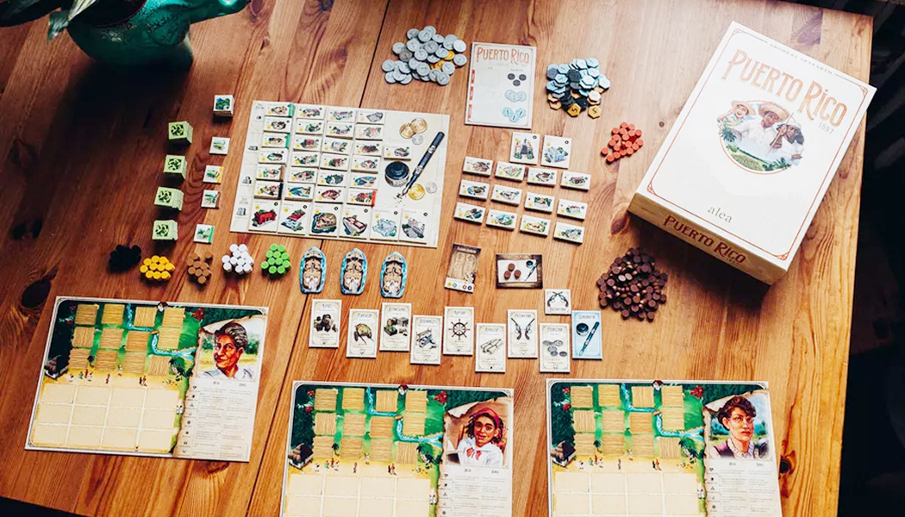
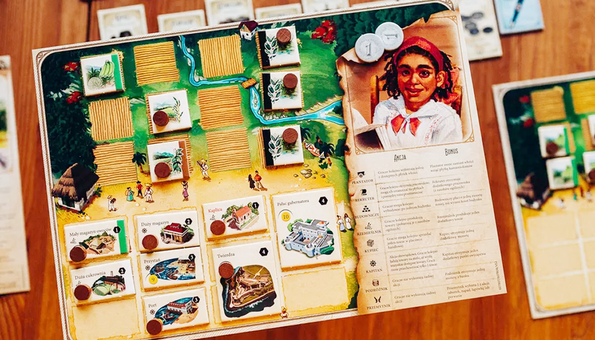

> เกม Puerto Rico 1897 มีธีมเกี่ยวกับการพัฒนาเศรษฐกิจและการค้าในช่วงปลายศตวรรษที่ 19 บนเกาะเปอร์โตริโก ซึ่งขณะนั้นอยู่ภายใต้การปกครองของสเปน แต่กำลังเข้าสู่ช่วงเปลี่ยนผ่านสู่ความเป็นอิสระ ผู้เล่นรับบทเป็นชาวเมืองที่พยายามสร้างความเจริญให้กับเกาะของตนเองผ่านการปลูกพืชผลสำคัญ เช่น ข้าวโพด น้ำตาล กาแฟ ยาสูบ และคราม เพื่อนำไปค้าขายและพัฒนาเมือง

### Setup

#### บอร์ดกลาง

1. วางเงินและไทล์ building ไว้ที่บอร์ดกลาง
2. ทำกองคว่ำไทล์ไร่แล้วเปิดตามจำนวนผู้เล่น + 1
3. ไทล์เหมืองวางไว้ข้างๆ ไทล์ที่เปิด
4. แต้ม
   1. 2 คน: 65 แต้ม
   2. 3 คน: 75 แต้ม
   3. 4 คน: 100 แต้ม
   4. 5 คน: 126 แต้ม
5. การ์ด Role
   1. 2 คน: 7 ใบ (Adventurer ออก 1)
   2. 3 คน: 6 ใบ (Adventurer ออก 2)
   3. 4 คน: 7 ใบ (Adventurer ออก 1)
   4. 5 คน: 8 ใบ (ใช้หมด)
6. เรือ
   1. 2 คน: 4, 6
   2. 3 คน: 4, 5, 6
   3. 4 คน: 5, 6, 7
   4. 5 คน: 6, 7 ,8
7. สินค้า (2 คนเอาออกชนิดละ 2)
8. Trading House
9. Work Register (วางคนงานตามจำนวนผู้เล่น)
10. คนงาน
    1. 2 คน: 40 ตัว
    2. 3 คน: 55 ตัว
    3. 4 คน: 75 ตัว
    4. 5 คน: 95 ตัว

---

#### บอร์ดผู้เล่น

1. ผู้เล่นคนแรกได้การ์ด Governor
2. แผ่นเกาะ
3. เงิน ตามจำนวนผู้เล่น - 1
4. ไทล์ไร่
   1. 2 คน: 1st ผลไม้, 2nd ข้าวโพ้ด
   2. 3 คน: 1st ผลไม้, 2nd, 3rd, 4th ข้าวโพ้ด
   3. 4 คน: 1st, 2nd ผลไม้, 3rd, 4th ข้าวโพ้ด
   4. 5 คน: 1st, 2nd, 3rd ผลไม้, 4th, 5th ข้าวโพ้ด

### Gameplay

ใช้ระบบ Lead & Follow โดยแต่ละรอบจะเริ่มจากผู้เล่นคนแรก (คนที่มีการ์ด Governor) ให้เลือก Role แล้วเล่น จากนั้นคนถัดไปตามเข็มก็เล่น Role เดียวกับที่ผู้เล่นคนแรกเลือก เมื่อเล่นครบทุกคน คนถัดไปตามเข็มก็จะได้เลือก Role ที่เหลืออยู่ แล้วคนอื่นๆ ก็เล่นตามเหมือนเดิม เมื่อทุกคนได้เลือกได้ Role หมดแล้ว ถือว่าเป็นการจบ 1 รอบ ให้วนการ์ด Governor ตามเข็ม แล้วใส่เงิน 1 บาทบนการ์ด Role ที่ไม่ถูกเลือก จากนั้นคือ Role ที่เลือกไป แล้วเล่นรอบใหม่เหมือนเดิม (คนที่เลือก Role ที่มีเงินก็จะได้เงินไปด้วย)

ผู้เล่นจะเล่นวนไปเรื่อยๆ จนเข้าเงื่อนไขจบคือ

1. คนงานหมด
2. แต้มหมด
3. มีคนสร้าง Building ครบ 12 อัน

แล้วเกมจะจบในรอบนั้นเล่น (ทุกคนเลือก Role จนครบ)

#### Role

##### The Planter

เลือกไทล์ไร่ 1 ไทล์ จากที่เปิดอยู่ แล้ววางลงบนเกาะตัวเอง

<mark>ถ้าเลือกคนแรกจะได้เลือกเหมืองได้</mark>

> เมื่อทุกคนเล่นครบจะรีไทล์ทั้งหมด

---

##### The Recruiter

หยิบคนงานทีละ 1 ตัว จาก Work Register จากนั้นเอาคนงานย้ายไปทำงานต่อได้ทันที (ต้องวางที่ Building ได้)

<mark>ถ้าเลือกคนแรกจะได้หยิบคนงานจากกองกลาง 1 ตัว</mark>

> เมื่อหยิบหมดแล้วให้เติมตามจำนวนช่องของ building ที่ว่างของทุกคน ถ้าน้อยกว่าจำนวนคนให้เติมตามจำนวนคน

---

##### The Builder

ซื้อ Building (ราคามุมซ้ายล่าง, มุมบนขวาคือแต้ม) แล้ววางลงเกาะตัวเอง และถ้ามีเหมืองสามารถลดราคาได้ (ต้องมีคนงานด้วย) และต้องดูว่า Building นั้นสามารถใช้เหมืองลดได้กี่เหมือง แต่ละเหมืองลด 1 บาท

<mark>ถ้าเลือกคนแรกได้ลดราคา 1 บาท</mark>

> สร้าง Builiding ซ้ำไม่ได้

---

##### The Craftsman

ผลิตสินค้าจาก Building และไร่ข้าวโพด เงื่อนไขจาก Building คือต้องมีไร่ตรงกับอาคาร เช่น ถ้าอยากได้ผลไม้ 2 ต้องมีไร่ผลไม้ 2 ไร่ และคนงานทำที่ Building ผลไม้ 2 คน ถ้ามีไร่เดียวก็จะได้แค่ 1 ผลไม้

<mark>ถ้าเลือกคนแรกจะได้หยิบสินค้า 1 ชิ้นจากสินค้าที่ผลิตได้ (เลือกแค่ 1 ชนิด)</mark>

> ของมีจำกัด ถ้าสินค้าหมดต้องรอคนเอาสินค้าไปขาย

---

##### The Trader

<u>สินค้าแลกเงิน</u>

เลือกสินค้า 1 ชิ้น เอาไปขายแล้วได้เงินตามเลขที่บอกบนการ์ด เงื่อนไขคือขายได้ชนิดละชิ้น ถ้าเต็มแล้วถึงโละใหม่

<mark>ถ้าเลือกคนแรกได้เงินเพิ่ม 1 บาท (แต่ต้องขายได้)</mark>

---

##### The Captain

<u>สินค้าแลกแต้ม</u>

โหลดสินค้าลงเรือ โดยเลือกแค่ 1 ชนิด ซึ่งเรือแต่ละลำจะรับได้แค่ 1 ชนิด และรับสินค้าซ้ำกับเรืออื่นไม่ได้ เมื่อโหลดแล้วจะได้ 1 แต้มต่อจำนวนสินค้าที่โหลด เมื่อโหลดจนครบทุกคนต้องทิ้งสินค้าให้เหลือแค่ชิ้นเดียว

<mark>ถ้าเลือกคนแรกจะได้เพิ่ม 1 แต้ม (แต่ถ้าโหลดไม่ได้ จะไม่ได้โบนัสนี้)</mark>

> ถ้าโหลดได้ บังคับโหลดเสมอ

---

##### The Adventurer

<mark>ได้เงิน 1 บาทจากธนาคาร ได้แค่คนแรก คนที่เหลือไม่ได้ทำ</mark>

---

### Endgame & Scoring

#### Endgame

1. คนงานหมด
2. แต้มหมด
3. สร้าง building เต็มเกาะ (building ใหญ่จะเป็น 2 ช่อง)

เมื่อเข้าเงื่อนไข จะเล่นจนจบรอบ ทุกคนได้เลือก Role

---

#### Scoring

1. Building ทั้งหมด
2. VP ที่เก็บมาทั้งเกม
3. แต้มโบนัสจาก building ใหญ่

ถ้าแต้มเสมอ เอาเงิน + จำนวนสินค้า ใครเยอะสุดจะชนะ

---

---

### 2P rules

#### Setup

1. แต่ละคนได้รับ เงิน 3 บาท, คนแรกได้ไร่ผลไม้ และคนที่สองได้ไร่ข้าวโพด
2. ใช้แต้มทั้งหมด 65 แต้ม
3. เอาไทล์ไร่ออกชนิดละ 3 (ข้าวโพด, ผลไม้, ผลไม้, ยาสูบ, เหมือง) แล้วเปิด 3 อัน
4. ใช้ Role 7 อัน (ยกเว้น The Adventurer 1 ใบ)
5. เรือ 4 และ 6
6. เอาสินค้าออกชนิดละ 2
7. Work Register เริ่มมามีคนงาน 2 และทั้งเกมใช้ 40 ตัว

#### Gameplay

เล่นเหมือนปกติ แต่จะได้เลือก 3 Role ต่อรอบ

#### Endgame & Scoring

เหมือนตัวเกมปกติ
