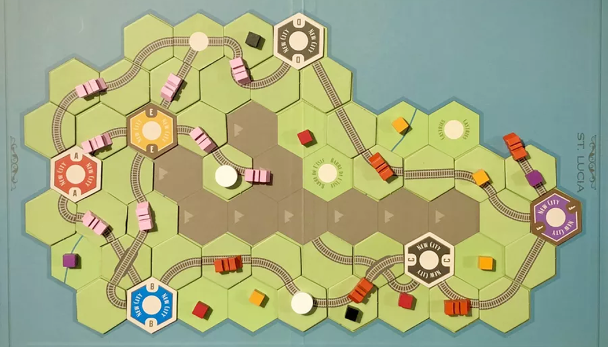
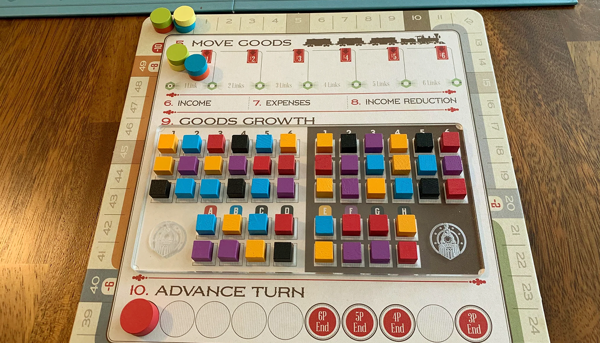
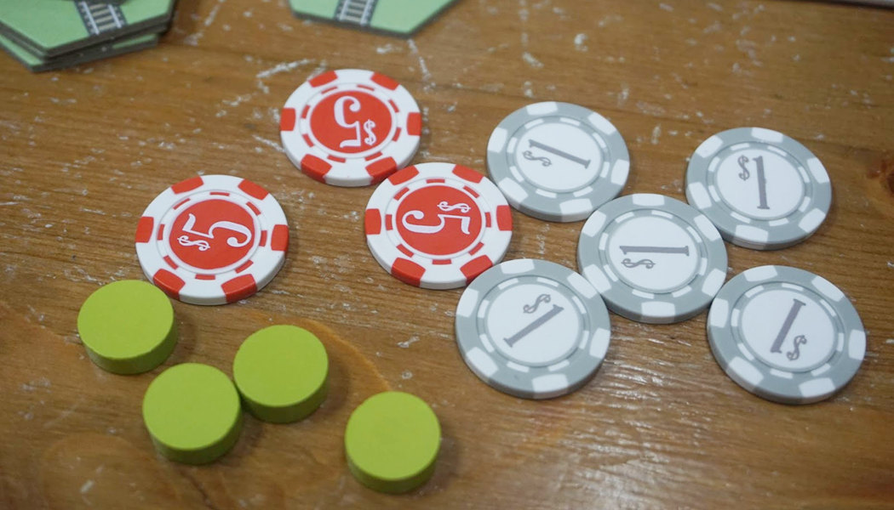

> ม้าเหล็กพ่นไอน้ำคำรามไปทั่วทุ่งราบอันกว้างใหญ่! ย้อนเวลากลับไปในยุคการบุกเบิกของรถไฟ เราต่างกันแข่งขันกันส่งสินค้าจากเมืองสู่อีกเมือง

### Setup

<mark>บางอย่างจะมีการเปลี่ยนแปลงเมื่อเปลี่ยนแผนที่ Setup นี้เป็น Basic setup</mark>

#### บอร์ดกลาง

1. วางไทล์แยกประเภทไว้
2. วางไทล์เมืองแยกสีไว้
3. เหรียญ เทา: 1$, แดง: 5$, น้ำเงิน: 25$
4. เอา Cube ใส่ถุง

   1. สุ่มวาง Cube (สีขาวใช้แค่บาง Expension) ไว้ที่ Goods Growth
   2. สุ่มวาง Cube 3 อันที่ Wheeling และเมืองที่เหลือจะวาง 2 อัน

5. วาง Turn track ไว้ที่ Start
6. ผู้เล่นแต่ละคนวาง Disk ที่ Display board ดังนี้
   1. Issued Shares
   2. Determine Player Order
   3. Select Actions
   4. Income Track ที่ 0
   5. Engine Track
7. ได้เงินเริ่มต้น 10$

### Gameplay

เกมจะมีทั้งหมด 10 เฟส เมื่อจบ 10 เฟสคือจบ 1 รอบ โดยจะเล่นจำนวนรอบตามจำนวนผู้เล่น ในแต่ละรอบจะประมูลเทิร์นออเดอร์แล้ววาง Action จากนั้นสร้างราง ส่งสินค้า รับ Income จ่ายหนี้ แล้วเริ่มรอบใหม่

#### Phase

##### I. Issue Share

Issue 1 share = 5$

หนี้อยู่มุมบนขวาของแต่ละช่อง ซึ่งจะจ่ายในเฟส <mark>Pay Expenses</mark>

---

##### II. Determine Player Order

ประมูลหาลำดับการเล่น โดยคนแรกจะประมูลก่อน เริ่มต้นที่ 1$ ลำดับถัดไปประมูลต่อ (ในตาแรกจะวนตามเข็มจากคนแรก) ซึ่งใครผ่านคนแรก จะไปอยู่ตำแหน่งสุดท้ายแต่ไม่ต้องจ่ายเงินค่าประมูล

> ที่ 1 และ 2 จะต้องจ่ายเต็ม
> ที่ 3 หรือตรงกลางจะจ่ายครึ่งหนึ่ง ปัดขึ้น

---

##### III. Select Actions

เลือกทำ Actions ตามลำดับผู้เล่น

<mark>Locomotive</mark> จะได้เลื่อนในส่วน Engine Track 1 ช่องทันที

---

##### IV. Build Track

1. สร้างรางได้สูงสุด 3 ราง โดยจะเริ่มสร้างจากลำดับผู้เล่นคนแรก ถ้ามีคนเลือก <mark>First Build</mark> จะได้สร้างก่อนแล้วค่อยเป็นผู้เล่นคนแรก
2. ราคารางจะอยู่ใน Display board
3. เมื่อวางรางให้เอา Disk ของตัวเองวางไว้บนรางที่สร้างเสร็จแล้วและยังไม่เสร็จ เพื่อบอกว่ารางนี้เป็นของใคร ซึ่งรางไหนที่ยังไม่เสร็จแล้วรอบหน้าไม่ได้มาสร้างต่อ จะต้องเอา Disk ออก (คนอื่นมาเคลมได้)

<mark>Engineer</mark> สร้างได้ 4 ราง

<mark>Urbanization</mark> วางเมืองบน Town ก่อนแล้วสร้างราง

> รางสามารถสร้างออกจากเมืองไหนก็ได้ หรือ รางของตัวเองที่ยังไม่เสร็จ
>
> ใช้รางธรรมดาทำเป็น Town ได้ โดยใช้แท่งขาววางลงไป จ่ายราคาเหมือนรางเมือง

---

##### V. Move Goods

ผู้เล่นทุกคนจะได้ทำ 2 ครั้ง โดยจะทำหรือไม่ทำก็ได้

> อัปเกรดได้ครั้งเดียว แต่ส่งสินค้าได้ 2 ครั้ง

1. เลือกว่าจะอัปเกรด Link หรือ ส่งสินค้า
2. ส่งสินค้าโดย<mark>สี Cube กับสีเมืองต้องเหมือนกัน</mark> ถ้าไหลมาเจอสีเดียวกันถือว่าจบการส่ง
3. เมื่อส่งแล้วได้ขึ้น Income ตามจำนวนการผ่านเมือง เช่น ผ่าน 2 เมือง ได้ขึ้น 2 Income

> 1 Link = ผ่านได้ 1 เมือง (ไม่นับจุดเริ่ม)

---

##### VI. Collect Income

ได้เงินโดนดูที่ Income track

---

##### VII. Pay Expenses

จ่ายหนี้จากค่า Issue Share + จำนวน Link ถ้าเงินขาดจะต้องลด Income 1

> ถ้าลด Income ไม่ได้แล้วจะถือว่าล้มละลาย ออกจากเกมทันที

---

##### VIII. Income Reduction

ลด Income ตามช่องเทาๆ ข้างหน้า เช่นถ้าได้ 11- 20 จะโดนลบ 2 Income

---

##### IX. Goods Growth

เติมสินค้าไปยังเมืองต่างๆ โดยทำด้านสว่างก่อนแล้วค่อยทำด้านมืด

1. ทอยเต๋าเท่ากับจำนวนผู้เล่น (นับคนที่ล้มละลาย) เต๋า 1 ลูก แทนสินค้า 1 ชิ้น
2. หยิบสินค้าโดยดูคอลัมน์ที่ตรงกับเลขที่ทอย แล้วเอาไปวางในเมืองที่เลขเดียวกัน
3. ถ้ามีคอลัมน์ตัวอักษรด้านล่างให้เอาไปวางเมืองที่ตรงกับตัวอักษร (ถ้าไม่มีไม่ต้องวาง)
4. ทำใหม่อีกครั้งแต่หยิบจากด้านมืด

<mark>Production</mark> ให้สุ่มหยิบสินค้า 2 อันวางที่ไหนก็ได้ที่เป็นที่ว่าง

---

##### X. Advance Turn Marker

เลื่อนรอบขึ้นไป 1 รอบ

### Endgame & Scoring

Turn marker มาถึงรอบสุดท้าย เล่นจนจบรอบนั้นแล้วจบเกม

#### Scoring

3 แต้ม / Income track

-3 แต้ม / Issue share

1 แต้มต่อรางที่ Complete (เมือง - เมือง)

<mark>( (Income - Issue share) x 3 ) + แต้มจากราง</mark>
