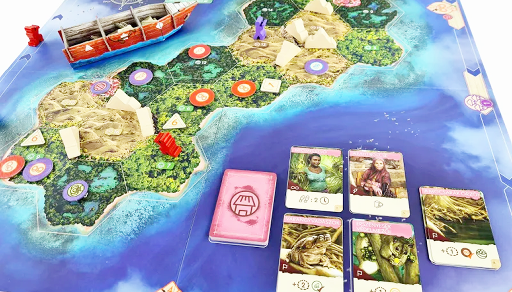

> แข่งกันตามหาสัตว์สายพันธุ์หากยากในเกาะ ผู้ชนะคือคนที่มีแต้มเยอะสุด ซึ่งแต้มจะหาได้จากการค้นพบสายพันธุ์สัตว์ต่างๆ

### Setup

1. เปิดแอพแล้วเลือกว่าจะเล่นเกาะไหน สัตว์ตัวไหน จะสุ่มจากแอพหรือสุ่มเองแล้วค่อยเลือกในแอพก็ได้
2. แยกโทเคนเลขตามรูปทรงใส่ในเรือ
3. ดูว่านั่งทิศไหนของแผนที่ แล้วแจกกระดาษจดให้ตามทิศ

### Gameplay

เกมจะใช้ระบบ Time track คนที่อยู่ด้านหลังจะเล่นได้เรื่อยๆ จนกว่าจะนำคนหน้า โดยจะมีให้เลือกทำ 1 ใน 5 Actions เพื่อหาจุดเชื่อมโยงของสัตว์ภายในเกาะ ยิ่งสำรวจแคบยิ่งเดินไกล และมี Leader เป็นบอทที่จะเดินเมื่อทุกคนผ่านเขาไป ซึ่งจะทำให้ผลประโยชน์บางอย่างเช่น คำใบเพิ่ม หรือ การเดาสัตว์เพื่อทำแต้ม ในตอนจบเกมคนที่เจอสัตว์หายากอาจะแพ้ก็ได้

สายพันธุ์สัตว์ในเกมจะมีทั้งหมด 4 สายพันธุ์ และอีก 1 สายพันธุ์ที่เราต้องตามหา โดยในแต่ละช่องจะมีแค่สัตว์สายพันธุ์เดียวเท่านั้น

1. Cuscus: อยู่ 3 ที่เท่านั้น โดยทุกตัวจะอยู่ห่างกันแค่ 1 - 2 ช่อง
2. นก: อยู่ 4 ช่อง โดยอยู่เป็น Pattern
3. กบ: อยู่ 2 ช่อง โดยอยู่ข้างๆ ช่องว่าง 2 ช่อง
4. งู: จะไม่อยู่ใกล้ Cuscus
5. ??: อยู่ในช่องว่าง (ในเกมมีทั้งหมด 6 ซึ่งจะมีช่องหนึ่งมี ?? อยู่) ระหว่างเล่นจะได้คำใบเพิ่ม และดูนิสัยได้จากการ์ดสัตว์ตัวนั้นๆ

#### Flow

1. เริ่มมาคนที่อยู่หลังจะได้เล่นก่อน จากนั้นคนที่อยู่หลังสุดจะเล่นต่อเรื่อยๆ จนกว่าจะนำคนข้างหน้า
2. เลือกทำ 1 ใน 5 actions
3. เมื่อทำ Action แล้วให้เดินตัวเราไปตามจำนวนนาฬิกา
4. ถ้าทุกคนผ่าน Leader ทำตามเงื่อนไขบนช่องแต้ม
   1. วางโทเคนการสำรวจคว่ำไว้บนช่องในแผนที่ 0 - 2 อัน (วางช่องเดียวกันได้) และให้วางเลขตามรูปทรงด้านบน โดยจะเฉลยเมื่อ Leader เหยียบบนช่องที่บอกเฉลยเลขดังกล่าว
      1. ตอบถูกได้แต้มที่วางไว้ ถ้าเป็นคนแรกที่หานกเจอจะได้อีกแต้ม
      2. ตอบผิดเสียแต้ม และเอาออกจากเกม แล้วเดินไปข้างหน้าอีกช่อง
   2. ได้คำใบ้เพิ่มเติม

#### Actions

##### Visit town

<mark>1 - 3 ช่อง</mark>

ต้องเดินไปที่หมู่บ้าน แล้ววางโทเคนหมู่บ้าน (คนอื่นวางได้อีก) จากนั้นเลือก Research แล้วหยิบการ์ด

การ์ดสีชมพูหลักๆ จะมี 4 ประเภท

1. ใช้ทันที (สายฟ้า)
2. ติดตัว (อินฟินิตี้)
3. เก็บไว้ แต่ใช้ได้ครั้งเดียว (x1)
4. แต้มจบเกม (ธง)

---

##### Survey by Boat

<mark>4 - 6 ช่อง</mark>

สำรวจด้วยเรือ โดยในแอพให้กดเลือกว่าจะหาสัตว์อะไร เมื่อกดในแอพแล้วจะบอกว่าเจอกี่ตัว

---

##### Survey by Foot

<mark>1 - 3 ช่อง</mark>

สำรวจด้วยเท้า โดยในแอพให้กดเลือกว่าจะหาสัตว์อะไร เมื่อกดในแอพแล้วจะบอกว่าเจอกี่ตัว

---

##### Camera Trap

<mark>1 - 3 ช่อง</mark>

เอากล้องไปวางจุดที่หยุดเดิน แล้วจะรู้ว่าพื้นที่นั่นมีสัตว์อะไรอยู่ หรือเป็นที่ว่างหรือป่าว

---

##### ตอบว่าสปีชีส์อยู่ช่องไหน

<mark>ต้องระบุได้ว่าช่องข้างๆ มีอะไรอยู่</mark>

ทายว่า ?? อยู่ช่องไหน ถ้าถูกคนถัดไปจะได้ทายด้วยจนครบทุกคน ถ้าใครทายถูกจะได้แต้มตามระยะห่างจากคนที่ทายถูกคนแรก

---

### Endgame & Scoring

จบเมื่อมีคนหาสัตว์เจอ แล้วทุกคนจะได้โอกาสเลือกว่าจะหาสัตว์เหมือนกัน หรือ วางโทเคนสำรวจสัตว์ โดยเงื่อนไขขึ้นอยู่กับระยะห่างจากคนทำจบเกม

#### Scoring

1. แต้มจากการวางโทเคนในพื้นที่นั้นถูกคนแรก
2. แต้มของสัตว์แต่ละชนิดที่เจอ
3. แต้มของสัตว์หายากร
