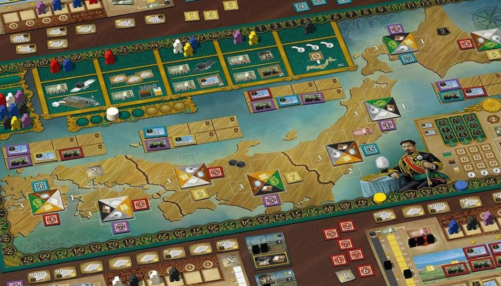
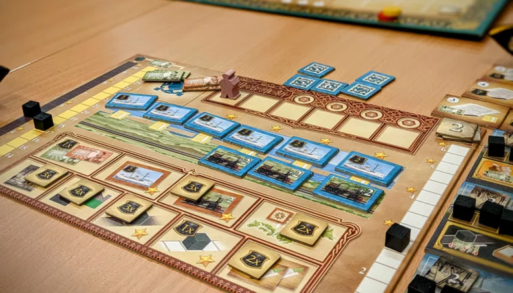
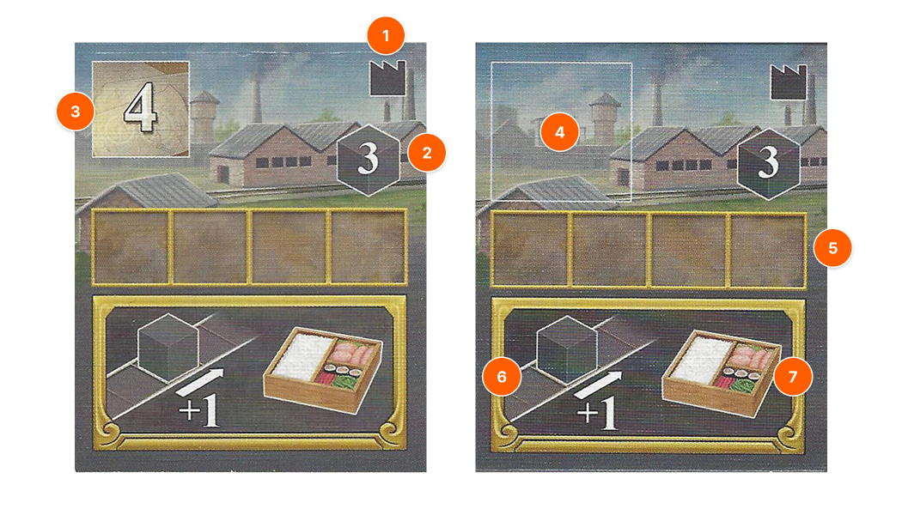

> Zaibatsu กลุ่มการเงินซึ่งมีบทบาทที่สำคัญในวงการธุรกิจช่วงสมัยเมจิ จนถึงสมัยก่อนสงครามโลกครั้งที่สอง ในช่วงการปฏิรูปเมจิที่มุ่งเน้นการสร้างความทันสมัยและอุตสาหกรรม รัฐบาลญี่ปุ่นได้สนับสนุนการขยายตัวของกลุ่มบริษัทนี้ เพื่อให้เป็นกำลังสำคัญในการพัฒนาประเทศ

เกมนี้เราจะมาเป็นกลุ่มบริษัทยักษ์ใหญ่ของญี่ปุ่นในสมัยเมจิ ที่ถูกเรียกว่า "Zaibatsu" ซึ่งเป็นกลุ่มบริษัทขนาดใหญ่ที่มีอิทธิพลมหาศาลต่อเศรษฐกิจญี่ปุ่นในยุคนั้น เป้าหมายของผู้เล่นคือการพัฒนาอาณาจักรธุรกิจของตนเอง โดยการลงทุนในอุตสาหกรรมใหม่ๆ พัฒนาเทคโนโลยี และส่งสินค้าเพื่อตอบสนองความต้องการภายในประเทศ ผู้เล่นที่สามารถสร้างอิทธิพลได้มากที่สุดจะเป็นผู้ชนะ

### Setup

#### Main board

1. วาง VP Marke แต่ละคน โดยคนแรก 10 / 11 / 12 / 13 (ตามลำดับ 1 - 4)
2. Scoring Marker ที่ช่อง Scoring Track
3. VP x2 ไทล์ วางไว้ข้างๆ
4. ไทล์โรงงาน วางไว้ข้างๆ โดยแยกตามประเภทสินค้า (ผ้าไหม, กระดาษ, แว่น, เบนโตะ, นาฬิกา, หลอดไฟ) และหงายด้านที่มุมซ้ายคือ 2
5. Reward ไทล์วางที่โซน Reward slot โดยเรียงจาก 2 - 5 แต่ละเลขจะมี Blueprint, Coal, เงิน โดยวางหงายด้านโบนัสขึ้นและเรียงให้แต่ละชนิดอยู่แถวเดียวกัน `(3 คน: เอาออกอย่างละ 1, | 2 คน: เอาออกอย่างละ 2)`
6. สุ่มวางไทล์เมือง
7. Worker ใส่ถุง `(3 คน: แต่ละสีเอาออก 1 ตัว | 2 คน: แต่ละสีเอาออก 2 ตัว)`
8. หยิบ Worker จากถุงแล้ววางช่อง Action ช่องละ 3 ตัว และทำแบบเดียวกันกับ Worker row (ด้านข้าง) `(3 คน: ใช้แค่ 3 row แต่ละ row 3 ตัว | 2 คน: ใช้แค่ 2 row แต่ละ row 2 ตัว)`

#### Player board

1. Player board ตามสี
2. Contract: 8 แผ่น
3. Blueprint 1: 1 แผ่น
4. Influence: 10 แผ่น (ตามสี)
5. 12,000 Yen
6. Cube ดำ: วางที่ช่องเงิน
7. เรือ: 6 ไทล์ วางด้าน 2VP
8. รถไฟ: 6 ไทล์ วางด้าน +2
9. Cube ดำ: วาง Track Coal, Money, Knowledge ล่างสุด

### Gameplay

#### Overview

เมื่อเข้าตาตัวเอง จะทำได้ 1 ใน 2 Action คือ

1. หยิบ Woker แล้วเลือกทำ 1 ใน 2 Action ข้างล่าง
2. Consolidate

`Free action` สามารจ่าย Blueprint 3 แต้ม เพื่อขึ้น Track เงิน, Coal หรือ Knowledge ได้ 1 ขั้น

---

#### Worker

##### การหยิบ Worker

1. หยิบ Worker 1 ตัว
2. เอา Worker มาวางจากซ้ายไปขวาในช่อง Worker slot ใน Player board
3. เลือกทำ 1 Action จากช่องที่หยิบ Worker มา
   สีของ Worker ไม่มีผลต่อการทำ Action แต่จะไปมีผลตอน Consolidate

> ต้องสามารถทำ Action ได้อย่างน้อย 1 อย่าง ถึงสามารถหยิบ Worker จากช่องนั้นได้

##### Worker Action หมด

หลังจากมีผู้เล่นหยิบ Worker ตัวสุดท้ายออกจากช่อง Action จนช่องนั้นว่าง ให้เอา Worker แถวบนสุดใน Worker row มาเติมช่องที่ว่าง

##### Worker Row หมด

เมื่อ Worker actoin หมด แล้ว Worker row หมดด้วย

1. เติม Worker ในช่อง Action ทั้งหมด โดยการสุ่มหยิบ Worker จากถุงและเติมให้เต็ม 3 เหมือนตอน setup
2. เติม Worker row ตามจำนวนเหมือนตอน Setup ถ้า Worker ในถุงหมดให้เติมเท่าที่มี
3. เลื่อน Scoring Marker 1 ขั้น
4. เมื่อ Marker ข้ามสัญลักษณ์นับแต้ม ให้นับแต้ม
5. เมื่อนับแต้มครั้งที่ 3 จะจบเกมทันที

---

#### Actions

##### 1. Knowledge (เพิ่มความรู้)

จ่ายเงิน 1,000 / 3,000 / 6,000 เพื่อขึ้น Track Knowledge 1 / 2 / 3 ขั้น

##### 2. Produce (ผลิตสินค้า)

1. ผลิตได้สูงสุด 3 โรงงานที่ต่างกัน
2. จ่าย Coal ตามที่โรงงานระบุ
3. เอา Cube จากกองกลางมาวางใน Storage Area
4. ถ้ามี Machine จะได้วางเพิ่มตามจำนวนบวก (+1, +2)

##### 3. Export (ส่ง Contract)

1. ส่ง Contract สูงสุด 3 อัน
2. เลือก Contract ของตัวเองที่หงายอยู่
3. จ่ายสินค้าตามจำนวนที่ Contract ต้องการ โดยจะต้องทำ Contract ทั้งหมดในครั้งเดียว
   - เลขใน Cube คือจำนวนสินค้าที่ต้องการใน 1 โรงงาน
   - จำนวน Cube คือสินค้าจากโรงงานที่ต่างกัน
4. รับโบนัสที่ระบุไว้ที่มุมล่างซ้ายของ Contract
5. เลื่อน Track เงินของตนเองขึ้น 1, 2, หรือ 3 ขั้น (ตามที่ระบุที่มุมล่างขวา) โดย Marker ไม่สามารถเลื่อนเกินช่องบนสุดได้
6. พลิก Contract คว่ำหน้าลง

##### 4. Invest (สร้างโรงงาน)

1. จ่าย 6,000 แล้วเลือกสร้างโรงงาน
2. มีระดับ Knowledge เพียงพอ ตามที่โรงงานนั้นกำหนด
3. หาก Knowledge ไม่เพียงพอ จะต้องทิ้ง Blueprint เป็นจำนวน Knowledge ที่ขาดไป หากไม่มี Blueprint เพียงพอ จะสร้างไม่ได้
4. วางโรงงานหงายหน้าขึ้น

`Anatomy`

1. level
2. จำนวน Coal ที่ต้องจ่ายเมื่อ Produce
3. จำนวน Knowledge ขั้นต่ำ
4. Machinery Slot
5. Storage Area
6. โบนัส
7. สินค้าที่ผลิตได้

##### 5. Mines

จ่ายเงิน 1,000 / 3,000 / 6,000 เพื่อขึ้น Track Coal 1 / 2 / 3 ขั้น

##### 6. Ships

1. สร้างเรือ 1 - 3 ลำ แต่ละลำราคา 5,000
2. นำลำที่สร้าง จาก Player Board ของตนเอง จากซ้ายไปขวา
3. วางเรือแต่ละลำบน Train/Ship slot ที่ว่าง บน Main board หากจะวางเรือมากกว่า 1 อันในครั้งเดียว ต้องวางใน Region ที่แตกต่างกัน
4. หากเรือและรถไฟของแถวนั้นหมด จะได้ขึ้น Income

> เรือจะให้ VP เพิ่มเติมระหว่างการ Scoring

##### 7. Machinery (ซื้อเครื่องจักร)

1. ซื้อหรืออัพเกรดเครื่องจักร 1 - 3 ครั้ง (5,000 / 10,000 / 15,000)
2. แต่ละครั้งสามารถซื้อหรืออัพเกรดก็ได้
   - ติดตั้งเครื่องจักรใหม่: นำ Machine วางโดยหงายหน้า "+1" ลงในช่อง Machinery slot ที่ว่างของโรงงานที่เลือก
   - อัปเกรดเครื่องจักรที่มีอยู่: พลิก Machine ที่วางอยู่บนโรงงานใดก็ได้ของตนเอง ไปยังหน้า "+2" (Machine ที่เป็น "+2" แล้วไม่สามารถอัปเกรดได้อีก)
3. เมื่อวางเครื่องจักรบนโรงงานแล้ว จะไม่สามารถย้ายหรือถอดออกได้
4. ผู้เล่นต้องติดตั้ง/อัปเกรดเครื่องจักรในโรงงานที่มีอยู่ก่อน หากทำไม่ได้ จึงจะสามารถนำเครื่องจักรแบบ "+1" เข้ามาเก็บใน Supply ของตนเองได้

##### 8. Trains

1. สร้างรถไฟ 1 - 3 ขบวน แต่ละขบวนราคา 5,000
2. นำรถไฟที่สร้าง จาก Player Board ของตนเอง จากซ้ายไปขวา
3. วางรถไฟแต่ละอันบน Train/Ship slot ที่ว่าง บน Main board หากจะวางรถไฟมากกว่า 1 อันในครั้งเดียว ต้องวางใน Region ที่แตกต่างกัน
4. หากเรือและรถไฟของแถวนั้นหมด จะได้ขึ้น Income

> รถไฟจะให้แต้ม Influence เพิ่มเติมระหว่างการ Scoring

##### 9. Local Market

1. วาง Influence ไทล์สูงสุด 3 อันใน 1 Region
2. ทิ้งสินค้า 1, 2 หรือ 3 cube จาก Storage Area ของโรงงาน โดยดูที่มุมขวาล่างของ Main board จะบอกโรงงานแต่ละ Level ที่ต้องทิ้งสินค้ากี่ชิ้นถึงจะได้วาง Influence ไทล์
3. วาง Influence ไทล์ตามสินค้าที่ทิ้ง ลงใน Influence slot ที่ว่าง ข้างเมืองที่ตรงกับสินค้าที่ทิ้งไป
4. รับโบนัสของ Region นั้นทันที
   ถ้าจะวาง Influence ไทล์เพิ่ม จะต้องวางที่ Region เดียวกัน
5. สามารถวาง Influence ไทล์ทับอันที่ต่ำกว่าได้ โดยอันที่ถูกเอาออกให้กลับคืนเจ้าของเดิม หากวางไทล์ในช่องว่าแล้วเป็นไทล์ที่สูงกว่าไทล์ที่วางในเมือง ให้เอาไทล์ต่ำกว่าออกตามขีดจำกัดจำนวนไทล์

`ผู้เล่น 3 คน สูงสุดเมืองละ 3 ไทล์`
`ผู้เล่น 2 คน สูงสุดเมืองละ 2 ไทล์`

> ตัวเลขของ Influence slot มีผลแค่ตอน Scoring

---

#### Consolidate

1. ทิ้งเงินและถ่านหินออกหมดในช่องเงิน
2. รับ Income (track เงิน) - จำนวนสี worker (สีละ 3,000)
3. รับถ่านหิน
4. หยิบโบนัสจาก Reward slot ตามจำนวนคนงานที่มีถึง แล้วรับโบนัสทันที
5. พลิกโบนัส แล้วเลือกวางโบนัสแต้มจบเกม
6. เมื่อวางโบนัสแล้วจะย้ายหรือเอาออกไม่ได้
7. เก็บ Worker เข้าถุง

`โบนัส`

1. ทุก 6,000
2. ดาวเรือ
3. Influence ครบทั้ง 4 region
4. Machine +2
5. โรงงาน Level 2, 3
6. ดาว track Coal
7. ดาว track Knowledge
8. ทุก 2 Contract

---

### Endgame& Scoring

เกมจะจบเมื่อ Scoring ครั้งที่ 3 โดยการ Scoring แต่ละครั้งจะนับแต้มดังนี้

1. นับคะแนนแยก Region
2. คนที่มี Influence มากสุด จะได้ VP มากสุด
3. หากเสมอให้รวม VP ตำแหน่งที่ได้ + ตำแหน่งที่ต่ำกว่า แล้ว / 2 (ผู้เล่นที่ตำแหน่งต่ำกว่าจะได้ VP ตำแหน่งถัดไป)
4. รับแต้ม VP จากเรือของตัวเอง
5. หาก Region นั้นช่อง Influence ว่าง (ที่เป็นเลข) ให้เอามาบวกทั้ง Region แล้วจะนับว่าเป็นผู้เล่นคนหนึ่ง ซึ่งมีผลต่อแต้ม Majority ใน Region นั้น
6. เมื่อ Scoring Marker ถึงช่องทอง จะได้เล่นคนละ Action แล้วจะขยับทันที (3 Action ก่อนจบเกม)
