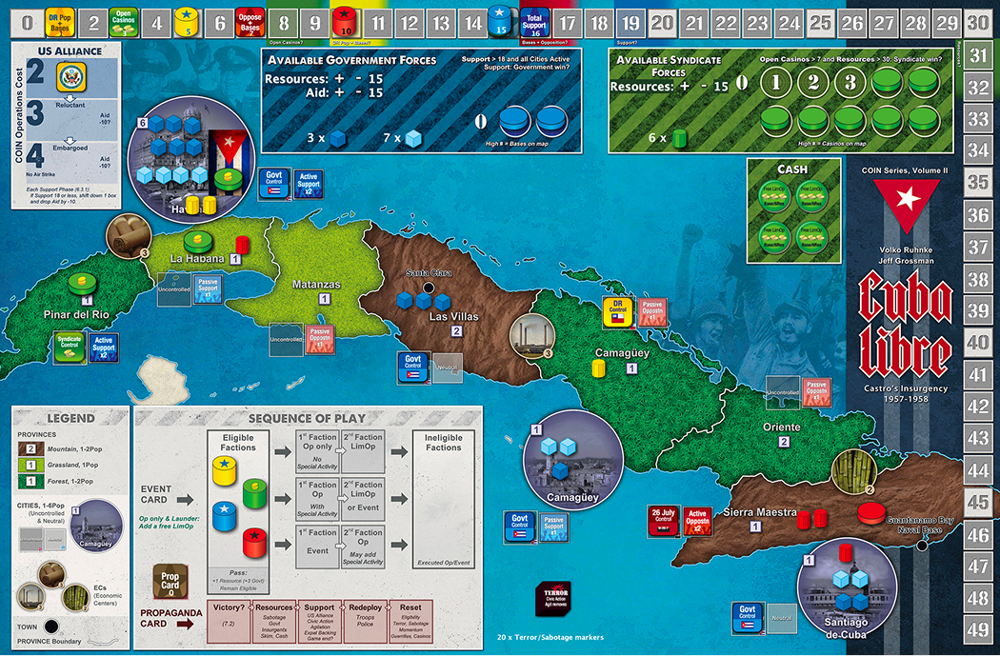
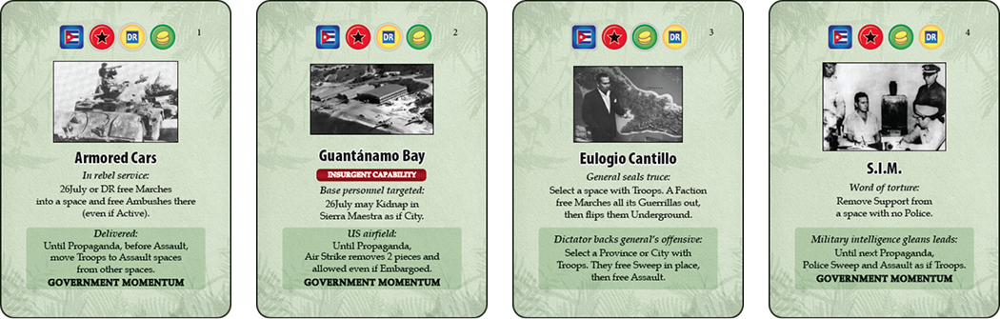
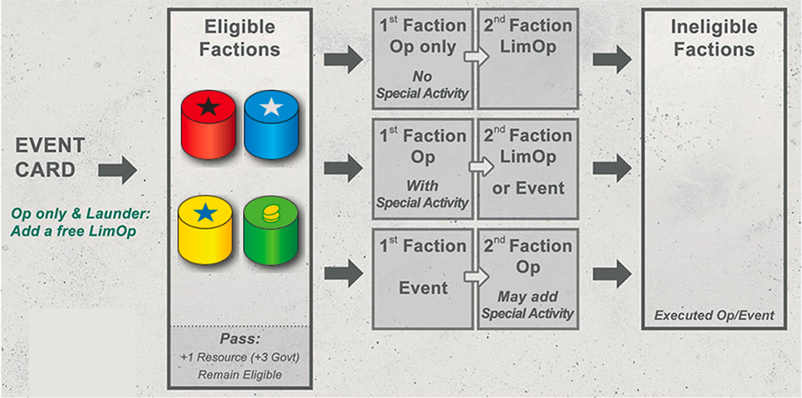
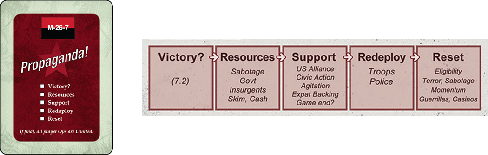
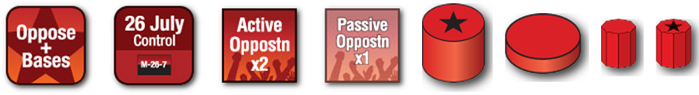

> Cuba Libre มีธีมจำลองความขัดแย้งระหว่างผู้ก่อความไม่สงบ (Insurgent) กับกลุ่มต่อต้านการก่อความไม่สงบ (Counterinsurgent หรือ COIN) ไม่ช่วงการปฏิวัติประเทศคิวบา 1957 - 1958

ผู้เล่นแต่ละคนจะสวมบทบาทเป็น 1 ใน 4 ฝ่ายที่พยายามยึดครองคิวบา:

รัฐบาล (Govt)

: ฝ่าย COIN มีกำลังทหารและตำรวจเป็นกำลังหลัก แหล่งทรัพยากรได้มาจากศูนย์เศรษฐกิจ (Economic Centers หรือ ECs) เป้าหมายคือการทำให้ประชาชนสนับสนุนและควบคุมเมืองสำคัญของคิวบา
 

ควบคุมเมืองทั้งหมด และ Total Support > 18

 
 

ขบวนการ 26 กรกฏาคม (M26)

: ฝ่ายก่อความไม่สงบ มุ่งเน้นการเคลื่อนไหวแบบกองโจร ก่อการร้าย และการปลุกปั่น เป้าหมายคือการทำให้ประชนชนต่อต้านรัฐบาล
 

Total Opposition + ฐาน > 15

 
 

คณะปฏิวัติ (Directorio หรือ DR)

: ฝ่าย COIN มีกำลังทหารและตำรวจเป็นกำลังหลัก แหล่งทรัพยากรได้มาจากศูนย์เศรษฐกิจ (Economic Centers หรือ ECs) เป้าหมายคือการทำให้ประชาชนสนับสนุนและควบคุมเมืองสำคัญของคิวบา
 

จำนวนประชากรที่ถูกควบคุม + ฐาน > 9

 
 

มาเฟีย (Syndicate)

: ฝ่าย COIN มีกำลังทหารและตำรวจเป็นกำลังหลัก แหล่งทรัพยากรได้มาจากศูนย์เศรษฐกิจ (Economic Centers หรือ ECs) เป้าหมายคือการทำให้ประชาชนสนับสนุนและควบคุมเมืองสำคัญของคิวบา

 

เปิดคาสิโน > 7 และมีทรัพยากร > 30

### Setup

1. เลือกว่าจะเล่นฝ่ายไหน คำแนะนำสำหรับจำนวนผู้เล่น:
   - ผู้เล่น 1 คน: ผู้เล่นจะควบคุมฝ่าย M26 หรือ Govt ฝ่ายที่เหลือจะถูกควบคุมโดยกฎของ Non-player
   - ผู้เล่น 2 คน: M26 + DR และ Govt + Syndicate หรือใช่ Non-player เล่นฝ่ายที่เหลือ
   - ผู้เล่น 3 คน: 1 คนควบคุม 2 ฝ่าย หรือใช่ Non-player เล่นฝ่ายที่เหลือ
   - ผู้เล่น 4 คน: ผู้เล่นแต่ละคนจะควบคุม 1 ฝ่าย
2. เตรียมการ์ด
   1. ถ้าเล่น Short game ให้เอา Event ออก 8 ใบ
   2. แยกเป็น 4 กองเท่าๆ กัน
   3. ใส่การ์ด Propaganda ในแต่ละกองแล้วสับกองการ์ด
   4. นำกองการ์ดเหล่านี้มาวางซ้อนกัน
3. US Alliance: อยู่ที่ Firm
4. Aid: 15
5. Resources:
   - Government: 15
   - Syndicate: 15
   - 26July: 10
   - Directorio: 5
6. ทุกฝ่ายอยู่ช่อง Eligible
7. Total Support: 16
8. Opposition + Bases: 7
9. Directorio Population + Bases: 1
10. Open Casinos: 3
11. แผนที่วาง Control Support และช จำนวนกองกำลัง ตามที่ระบุในแผนที่

### Gameplay

แต่ละรอบการ์ด Event จะเป็นตัวกำหนดลำดับการเล่น หากมีการเลือกเล่นไปแล้ว 2 ครั้ง ฝ่ายที่เหลือจะไม่ได้เล่นในรอบนั้น และฝ่ายที่เล่นไปแล้วจะเข้าไปในช่อง Ineligible ซึ่งจะเล่นการ์ดใบถัดไม่ได้ การ์ด Event จะเปิดมาเรื่อยๆ จนกระทั้งการ์ด Propaganda ถึงรอบปัจจุบัน จะเข้าสู่ Propaganda phase หากเปิดถึงใบที่ 4 เกมจะจบลงทันทีแล้วดูว่าใครทำแต้มได้มากสุดจะเป็นผู้ชนะ

#### Actions

##### Event

เลือกเล่น Event 1 อย่างบนการ์ด บางการ์ดจะมีคำว่า **"Insurgent Capabilities"** หากเล่น Event นั้น ให้เอา Insurgent Capabilities Maker วางไว้ในช่อง Insurgent Capabilities ซึ่งจะมีผลจนจบเกม

**Goverment Momentum** ถ้าเลือกเล่นจะย้ายการ์ดไปด้านข้างของกระดานกลาง ความสามารถจะคงอยู่จนกว่าจะ Reset Phase โดยจะมีกี่ใบก็ได้

---

##### Op (Main action)

แต่ละฝ่ายจะมี Main Action 4 อย่างที่ทำได้ ซึ่งอาจเหมือนหรือแตกต่างกัน โดยเลือกทำ 1 ใน 4 อย่างนั้น

---

##### LimOp (Limited Main action)

เลือกทำ 1 ใน 4 Main Action แต่จะทำได้แค่พื้นที่เดียว

---

##### Special Activity (Special Action)

แต่ละฝ่ายจะมี Special Action 3 อย่าง ให้เลือกทำ 1 ใน 3 อย่างนั้น

---

##### Launder

ฝ่ายที่มี Cash marker ของ Syndicate สามารถเลือกใช้เพื่อทำ LimOp ต่อจาก Op ได้ แต่เงื่อนไขคือจะไม่ได้สามารถทำ Special Action ต่อได้

---

#### Propaganda

เมื่อการ์ด Propaganda มาถึงจะทำทีละ Phase ตามลำดับดังนี้

##### Victory phase

เช็คเงื่อนไขการชนะของฝ่ายตัวเอง หากใครทำเงื่อนไขสำเร็จจะเป็นผู้ชนะทันที และเกมจะจบลงทันที หากทำเงื่อนไขสำเร็จมากกว่า 1 ฝ่าย ให้ดูว่าฝ่ายไหนมีแต้มมากสุด และหากแต้มเท่ากัน ผู้ชนะจะเป็นลำดับดังนี้

1. Syndicate
2. DR
3. M26
4. Govt

---

##### Resources phase

1. **Govt**: รับทรัพยากร = ผลรวมของมูลค่า EC (ยกเว้นที่มี Sabotage) + แต้ม Aid
2. **Insurgent**
   1. M26: จำนวนของฐาน
   2. DR: จำนวนพื้นที่ที่มีกองกำลังของเราอยู่
   3. Syndicate: จำนวนประชากรของเมื่องและ EC ที่กองกำลังของเรา > ตำรวจ (ยกเว้นที่มี Sabotage) + จำนวนคาสิโนที่เปิด x 2
3. **Skim**
   Syndicate จะจ่ายทรัพยากร 2 หน่วย สำหรับพื้นที่ที่คาสิโนเปิดอยู่ โดยมีฝ่ายอื่น Control อยู่

4. **Cash** `ลำดับการทำคือ M26, DR, Gvot, Syndicate`
   ฝ่ายไหนที่มี Cash marker สามารถเลือกทำ 1 ใน 2 อย่างนี้ต่อ Cash marker ที่ครอบครองอยู่

   1. แลกเป็นทรัพยากร 2 หน่วย
   2. แลกเป็นฐานหรือคาสิโน 1 อัน

   > แต่ละพื้นที่ (ยกเว้น EC) วางฐานได้สูงสุด 2 อัน และ คาสิโน 2 อัน

---

##### Support phase

1. **US Alliance**: ปรับระดับ US Alliance ถ้า Total support < 18 จะลง 1 ขั้น และลด Aid ลง 10 หน่วย
2. **Civic Action**: Govt จ่ายเท่าไหร่ก็ได้เพื่อเพิ่ม Support โดยจะต้องจ่าย 4 หน่วยต่อการเพิ่ม 1 ขั้น หากมี Terror marker อยู่ จะต้องจ่าย 4 เพื่อเอา Terror ออกได้ 1 อัน เมื่อเอาออกหมดแล้วถึงจะเพิ่ม Support ต่อได้
3. **Agitation**: M26 ทำเหมือน Govt แต่จ่ายแค่ทรัพยากร 1 หน่วย และเปลี่ยนเป็นฝั่ง Opposition
4. **Expat Backing**: DR เลือก 1 พื้นที่ทำ Rally ฟรี โดยต้องเป็นพื้นที่ที่ Neutral หรือ Passive เท่านั้น
5. **Game End?**: ถ้าเป็น Propaganda ใบสุดท้ายเกมจะจบทันที แล้วทำตามเงื่อนไข Victory phase

---

##### Redeploy phase

Govt สามารถย้ายตำรวจและทหารได้ดังนี้ โดยทำลำดับใดก่อนหลังก็ได้

1. ต้องย้ายทหาร ที่อยู่ใน EC หรือจังหวัดที่ไม่มีฐาน ไปยังเมืองที่ Govt Control หรือฐาน หากไม่มีพื้นที่นั้นจะย้ายไปยัง เมือง Havana
2. ย้ายตำรวจ ไปยัง EC หรือพื่นที่ที่ Govt Control
3. ย้ายทหาร ไปยังฐานหรือเมืองที่ Govt Control

---

##### Reset phase

1. ทุกฝ่ายย้ายไปช่อง Eligible
2. Terror, Sabotage เอาออกหมด
3. การ์ด Momentum เอาออก
4. กองกำลังฝ่ายก่อความไม่สงบทั้งหมดเปลี่ยนเป็นสถานะ Underground

### Victory

Govt: ควบคุมเมืองทั้งหมด และ Total Support > 18 
 

M26: Total Opposition + ฐาน > 15
 

DR: จำนวนประชากรที่ถูกควบคุม + ฐาน > 9 
 

Syndicate: เปิดคาสิโน > 7 และมีทรัพยากร > 30

### Strategy

#### Govt

เน้นไปที่การยึกครองเมืองและเพิ่ม Support

**หาทรัพยากร**
`รอบ Propaganda`

1. EC ที่ไม่มี Sabotage (สูงสุด 8 หน่วย)
2. Aid
3. Skim: 2 หน่วยต่อพื้นที่ Control ที่มีคาสิโน
4. Cash: แลกเป็นทรัพยากร 6 หน่วย

---

**Strategy**
`รอบ Event`

1. Train: สร้างตำรวจและทหาร
2. ทำ Civil Action (ต่อจาก Train) ในเมืองหรือจังหวัดที่รัฐบาลควบคุมอยู่ ซึ่งมีทั้งทหาร และ ตำรวจ อยู่ในพื้นที่ จ่าย 4 ทรัพยากร ต่อ ตัวหมาย Terror ที่จะลบ จากนั้น จ่าย 4 ทรัพยากร ต่อการเพิ่มระดับ +1 ไปยัง Active Support

`รอบ Propaganda`
ทำ Civil Action เน้นที่เมืองก่อน (เมืองทั้งหทด Active Support: 12+2+2=16 แต้ม)

#### M26

เน้นไปที่ยึดพื้นที่แล้วเพิ่ม Opposition

**หาทรัพยากร**
`รอบ Event`

1. Attack เพื่อยึดเงิน
2. Kidnap หากกองกำลังของ M26 มีจำนวนมากกว่าตำรวจ ในพื้นที่เป้าหมายฝ่ายใดฝ่ายหนึ่ง
   1. Syndicate: พื้นที่ที่มีคาสิโนเปิดอยู่
   2. Govt: ในเมือง หรือ EC
      ถ้ามี Cash ให้ยึดมา แต่ถ้าไม่มีจะได้รับทรัพยากรเท่ากับผลจากการทอยลูกเต๋า 1 ลูก

`รอบ Propaganda`

1. จำนวนของฐาน (สูงสุด 4 หน่วย)
2. Skim: 2 หน่วยต่อพื้นที่ Control ที่มีคาสิโน
3. Cash: แลกเป็นทรัพยากร 6 หน่วย

---

**Strategy**
`รอบ Event`

1. Rally กองกำลัง หรือ
2. Rally เพื่อเปลี่ยนกองกำลังเป็นฐาน
3. Terror: จ่ายทรัพยากรแล้ววาง Terror marker จากนั้นขึ้น Opposition 1 ขั้น

`รอบ Propaganda`

1. Agitation: จ่ายทรัพยากร 1 หน่วย เพื่อเอา Terror ออกและเพิ่ม Opposition 1 ขั้น

#### DR

เน้นไปที่การยึดครองพื้นที่ กระจายกำลังผลเพื่อรับทรัพยากร

**หาทรัพยากร**
`รอบ Event`

1. Subvert: เลือก 1 พื้นที่ แล้วได้รับทรัพยากรเท่ากับจำนวนประชากร

`รอบ Propaganda`

1. จำนวนพื้นที่ที่มีกองกำลังของเราอยู่
2. Skim: 2 หน่วยต่อพื้นที่ Control ที่มีคาสิโน
3. Cash: แลกเป็นทรัพยากร 6 หน่วย

---

**Strategy**
`รอบ Event`

1. Rally กองกำลัง หรือ
2. Rally เปลี่ยนกองกำลังเป็นฐาน

`รอบ Propaganda`

1. Expat Backing (Rally) ในพื้นที่ที่ DR ควบคุมอยู่ หรือเป็นพื้นที่ ที่ไม่มีฝ่ายใดควบคุม โดยพื้นที่นั้นต้องมีสถานะเป็น Passive หรือ Neutral (ประชากรในเมืองและจังหวัดทั้งหมด = 6+1+1+1+2+1+1+2+1+1 = 17 แต้ม)

#### Syndicate

เน้นไปที่การสร้างคาสิโนและเพิ่มทรัพยากรจาก Profit

**หาทรัพยากร**
`รอบ Event`

1. Profit ปิดคาสิโนเพื่อรับทรัพยากร 3 หน่วย และแลก Cash เป็นทรัพยากร 3 หน่วย

`รอบ Propaganda`

1. จำนวนประชากรของเมื่องและ EC ที่กองกำลังของเรา > ตำรวจ (ยกเว้นที่มี Sabotage) + จำนวนคาสิโนที่เปิด x 2
2. แลก Cash เป็นทรัพยากร 6 หน่วย

---

**Strategy**
`รอบ Event`

1. สร้างคาสิโน
2. Rally กองกำลังให้มากกว่าตำรวจ ในเมืองและใน EC เพื่อรับทรัพยากร
   ได้จากเมืองสูงสุด 8 (6+1+1)
   ได้จาก EC สูงสุด 8 (3+3+2)

`รอบ Propaganda`
แลก Cash เป็นทรัพยากร 6 หน่วย (สูงสุด 24 (6+6+6+6))
