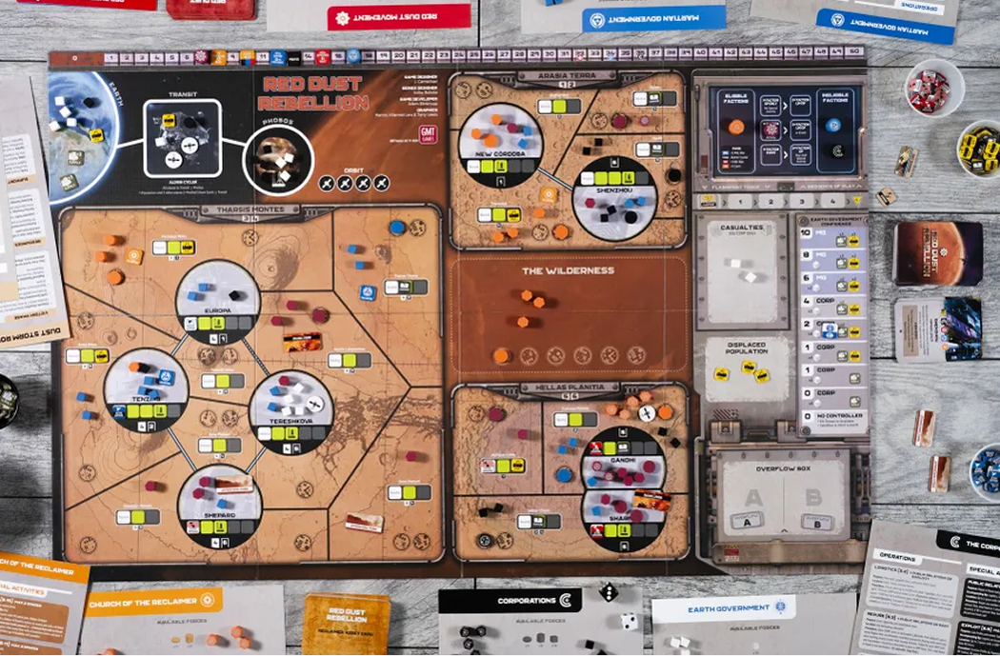
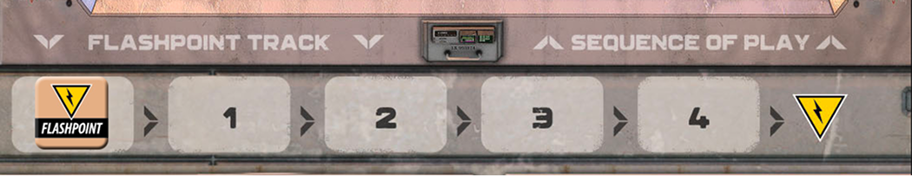

> "พรุ่งนี้พวกเขาจะมาถึง พรุ่งนี้คือวันครบรอบสองร้อยปี พรุ่งนี้เป็นอีกวันหนึ่งบนดาวอังคาร"

ผู้เล่นจะต่อสู้แย่งชิงอำนาจและกำหนดอนาคตของดาวอังคารในช่วงกลางศตวรรษที่ 23 ผู้เล่นแต่ละคนจะควบคุมหนึ่งใน 4 ฝ่าย ที่มีอุดมการณ์แตกต่างกัน และต้องใช้ความสามารถเฉพาะตัวของฝ่ายนั้น พร้อมกับเหตุการณ์ที่เกิดขึ้นในจังหวะที่เหมาะสม
เพื่อแผ่ขยายอิทธิพลและควบคุมดาวอังคารให้ได้มากที่สุด

ฝั่ง COIN (Counter Insurgency) หรือ ต่อต้านการก่อความไม่สงบ ประกอบด้วย ฝ่ายรัฐบาลต้องการปกครองดาวอังคารอย่างเบ็ดเสร็จ โดยมีรัฐบาลโลกหนุนหลัง และฝ่ายบริษัทที่ต้องการสัญญาปรับสภาพดาวอังคารเพื่อผลกำไรอย่างมหาศาล แต่ทั้งสองฝ่ายก็มีสงครามการเมืองเพื่อแย่งกันควบคุมรัฐบาลโลก

ส่วนฝั่งก่อความไม่สงบ (Insurgency) คือ ฝ่ายปฏิวัติดาวอังคาร หรือ "Duster" ที่ต้องการรัฐบาลโดยชาวอังคาร เพื่อชาวดาวอังคารอย่างแท้จริง และ ฝ่ายคริสตจักรผู้คืนผืนดาวที่ไม่อยากให้ดาวอังคารถูกทำลายซ้ำรอยเหมือนโลก มนุษย์ไม่ควรปรับสภาพดาว แต่ควรปรับตัวเองแทน

### Setup

1. นำ Unit และ ฐาน แต่ละฝ่ายวางบนกระดาน
2. วาง Marker,โทเคน และ Unit ตามตำแหน่งต่างๆ บนบอร์ดกลาง โดยดูได้ที่หน้าหลังของ Rulebook
3. ทอยเต๋าสองลูกแล้ววาง Approaching Storm ลงในพื้นที่ที่ตรงกับผลทอยนั้น ทำสองครั้ง หากได้พื้นที่ซ้ำให้เปลี่ยนเป็น Raging Storm ในพื้นที่นั้นแทน
   - **เต๋าขาว**: Sectors
   - **เต๋าดำ**: ตำแหน่งภายใน Sector นั้น
4. หากเกิด Raging Storm: CR สามารถเลือกเอา Unit ออกได้ 1 ตัวในพื้นที่นั้น

#### กองจั่ว

1. Campaign: 12 ใบ แล้วเปิดขึ้นมา 1 ใบ
2. Asset: จั่ว 3 ใบขึ้นมือ
3. Event:
   1. แบ่งเป็น 3 กอง กองละ 12 ใบ (12 ใบที่เหลือเอาออกจากเกม)
   2. สับการ์ด Dust Storm ลงใน 6 ใบล่างของแต่ละกอง
   3. เปิดการ์ดใบปัจจุบันและใบถัดไป
   4. ไม่ต้องสนใจ Flashpoint

### Gameplay

เกมจะเล่นเหมือน COIN Series ตามปกติ คือเริ่มจากฝ่ายที่มีสิทธิ์เลือกเล่นก่อน ว่าจะทำ "Action" หรือ "ผ่าน" หากการ์ดใบนั้นมีฝ่ายเลือกทำ Action ไปแล้ว 2 ฝ่าย จะจบรอบการ์ดใบนั้น จากนั้น Event ใบถัดไปจะมาเป็นใบปัจจุบัน แล้วเปิด Event ใบถัด จนกว่าการ์ด Dust Storm จะเป็นใบปัจจุบัน

Dust Storm จะทำการเช็คเงื่อนไขชนะ รับทรัพยากร ตาม Phase ปกติอง COIN แต่สิ่งที่เพิ่มเข้ามาใน Red Dust Rebellion คือระบบ Flashpoint ที่จะเกิดขึ้นระหว่างเกม

โดยการ์ด Event แต่ละใบจะมีค่าของ Flashpoint ทุกครั้งที่เปิดใบถัดไป ค่าของ Flashpoint จะเพิ่มขึ้นเรื่อยๆ เมื่อค่าถึงสุดแถบ จะเกิดรอบ Flashpoint ฝ่ายรัฐบาล บริษัท และ คริสตจักร จะเล่นตามลำดับ Flashpoint Phase

#### Factions

##### ฝ่ายรัฐบาลดาวอังคาร (MarsGov)

Total Support + EarthGov Confidence > 33

เชื่อว่าตนเองมีจุดยืนเพื่อประโยชน์สูงสุดของดาวอังคาร ประกอบด้วยข้าราชการที่ได้รับการแต่งตั้งจากโลก และเจ้าหน้าที่ท้องถิ่นที่มาจากการเลือกตั้ง MarsGov จำเป็นต้องได้รับการสนับสนุนจากชาวอังคาร เพื่อที่จะบริหารจัดการดาวอังคารอย่างมีประสิทธิภาพและต้องแข่งขันกับกลุ่มกบฏ Red Dust เพื่อชิงความนิยมจากประชาชน

##### ฝ่ายบริษัท (CORP)

Profits > 35

เป็นบริษัทที่อยู่ภายใต้การควบคุมจากโลก เข้ามาเพื่อหวังผลประโยชน์ในดาวอังคาร แม้ว่าจะมีทรัพยากรอันไร้ขีดจำกัด แต่สุดท้ายบริษัทก็ต้องรายงานผลกำไร (Profit) แก่ผู้ถือหุ้น ผลประโยชน์มหาศาลที่บริษัทมาลงทุนคือการคว้าสัญญาแปลงสภาพดวงดาว (Terraforming) รวมถือการเปิดธุรกิจต่างๆ ภายในเมืองบนดาวอังคารเพื่อสร้างกำไร

##### ฝ่ายปฏิวัติดาวอังคาร (RD)

Total Opposition + Base > 31

เชื่อว่าดาวอังคารควรมีรัฐบาลโดยชาวอังคารเอง ปลอดการแทรกแซงจากโลก ฝ่ายปฏิวัติพร้อมจัดตั้งรัฐบาล หากจำเป็นที่จะต้องใช้ความรุนแรง ฝ่ายนี้ยังเรียกตนเองว่า "Dusters" คอยปฏิบัติการภาพในเมืองบนดาวอังคาร รวบรวมประชาชนในพื้นที่เพื่อต่อต้านรัฐบาล และขับไล่ชาวโลกออกไป

##### ฝ่ายคริสตจักรผู้คืนผืนดาว (CR)

พื้นที่ CR Control + Base > จำนวนรวมของ Base ฝ่ายอื่น

คริสตจักรไม่อยากให้ดาวอังคารซ้ำรอยเหมือนโลกที่ถูกมนุษย์ทำลายจนย่อยยับ โดยมีความเชื่อว่ามนุษย์ต้องปรับตัวเข้ากับดาวอังคาร ไม่ใช่ปรับดาวอังคารให้เหมาะกับมนุษย์ คริสตจักรคัดค้านการแปลงสภาพดวงดาวและการตั้งอาณานิคมบนดาวอังคาร เพื่อให้ดาวอังคารกลับสู่ธรรมชาติดังเดิม

#### Asset & Campaign card

##### Asset card

การ์ด Asset จะใช้สำหรับการจ่ายทรัพยากรของ CR แทนการ์ด Event และปรับลำดับสิทธิ์ในการเล่น โดยจะถือได้สูงสุด 6 ใบ เมื่อเล่นแล้วให้ทิ่งลงกองทิ้ง ซึ่งกองทิ้งจะกลับเข้ากองจั่วใหม่ตอน Reset Phase ของ Dust Storm เท่านั้น

1. เมื่อใดก็ตามที่ต้องใช้ทรัพยากร จะต้องทิ้งการ์ด Asset ที่มีค่ารวม <u>`เท่ากับหรือมากกว่า`</u> จำนวนทรัพยากรที่ต้องใช้เพื่อดำเนินการนั้น สามารถทิ้งการ์ดหลายใบรวมกันได้ (บางใบจะเพิ่มขึ้นเมื่อทำบาง Operation)
2. ใบที่มีคำว่า Event สามารถทิ้งเพื่อใช้แทน Event ที่จะเล่นได้
3. ใบที่มีคำว่า Capabilities สามารถใช้แทน Event ได้ เมื่อใช้แล้วจะเป็นความสามารถติดตัวถาวร หากเล่นจะได้ทำ Operation ฟรี 1 ครั้งในสูงสุด 2 พื้นที่ จากนั้นจั่วการ์ด Asset 1 ใบ

##### Campaign card

การ์ด Campaign เป็นการ์ดของ RD จะเปิดตั้งแต่ Setup และจะเปิดได้อีกจากการทำ Operation <u>Campaign</u> หรือจากผลของ Event บางอย่างที่ระบุไว้

เมื่อการ์ด Campaign เข้าสู่เกม ให้วางหงายหน้าไว้บนโต๊ะ เพื่อบอกผลกระทบตลอดระยะเวลาการเล่นเกมจนกว่าถึง Reset Phase ของ Dust Storm

#### Flashpoint

เมื่อค่าของ Flashpoint เกิน 4 จะเข้าสู่ Flashpoint Phase ทันที แต่ละฝ่ายที่เกี่ยวของจะต้องทำดังนี้

##### 1. Aldrin Cycler

MarsGov, CORP

1.  ย้ายทุกอย่างใน Transit มา Phobos
2.  วาง Marker ประชากรทั้งหมดที่อยู่บน Phobos ไว้ใน Displaced Population
3.  ย้ายดาวเทียมจาก Phobos ไปยัง Orbit
4.  MarsGov รับทรัพยากร 3 หน่วยต่อ Supply บน Phobos (เมื่อรับแล้วให้เอาออก)
5.  ย้าย Marker ประชากร 1 อัน จากโลกไป Transit (ถ้ามี)
6.  ฝ่ายที่ควบคุม EarthGov ต้องเลือกชิ้นส่วน 5 ชิ้น ยกเว้น Marker ประชากร ย้ายจากโลก ไป Transit หากไม่มีผู้ควบคุม EarthGov จะไม่มีการย้าย
7.  CORP สามารถจ่าย Profit 1 หน่วย ต่อการย้ายชิ้นส่วน 1 ชิ้น ยกเว้น Marker ประชากร จากโลก ไป Transit

---

##### 2. Corporate Casualties

CORP

1. ลด Profit 1 หน่วย ต่อฐาน ที่อยู่ใน Casualties
2. ลด Profit 1 หน่วย ต่อ Security 2 ตัวที่อยู่ใน Casualties
3. ย้ายฐานและกำลังพลที่อยู่ใน Casualties ไปยัง Available Forces

---

##### 3. EarthGov Confidence

MarsGov, CORP

1. ย้ายดาวเทียมทั้งหมดบนดาวอังคาร ไปยัง Orbit
2. ปรับ EarthGov Confidence ตาม EG+ หรือ EG- (+ ขึ้น, - ลง)
3. นำชิ้นส่วนที่ระบุในช่องระดับนั้นไปวางที่โลก และดูว่าใครสามารถควบคุม EarthGov ได้ในรอบถัด
4. หากถึงระดับล่างสุด จะไม่มีใครได้คุมและเอาชิ้นส่วนทั้งหมดออกจากบอร์ดกลางไปไว้ที่ Available Forces

---

##### 4. Terraforming

CORP

1. เพิ่ม Profit 2 หน่วย ต่อ Terraforming แห่งแรกในแต่ละ Desert
2. เพิ่ม Profit 1 หน่วย ต่อ Terraforming แห่งที่เหลือในแต่ละ Desert
3. ลด Profit 1 หน่วย ต่อ Conversion Center (ของ CR)

---

##### 5. Dust Storms

CR

1. นำ Raging Storms ทั้งหมดออกจากแผนที่
2. Approaching Storms ทั้งหมดเป็น Raging Storm
3. ทอยเต๋าเพื่อวางพายุ จำนวนเท่ากับค่า Flashpoint ที่แสดงบนการ์ดใบถัดไป หรือจนกว่าในแผนที่จะมีพายุ 6 ที่ (หากยังเหลือจำนวนครั้ง ให้ทอยต่อเพื่อดูว่าพายุจะกลายเป็น Raging ไหม)
4. ในจุดที่เป็น Raging Storm ฝ่าย CR สามารถเอา Unit ฝ่ายอื่นออกได้พื้นที่ละ 1 ตัว (ฐานสุดท้าย)

---

##### 6. Attrition and Conversion

CR

1. Deserts ที่ไม่มีประชากร หรือมี Raging Storm และไม่มีฐาน COIN ให้เอาทหาร MarsGov ออก 1 ตัว ไว้ที่ Available Forces และ Security 1 ตัว ไว้ที่ Casualties (ถ้ามี)
2. Deserts ที่ไม่มีประชากร หรือมี Raging Storm และไม่มีฐาน RD ให้เอา Rebel ออก 1 ตัว
3. ในพื้นที่ที่มีประชากรและมี Conversion Center ให้วาง Rebel ของ CR 1 ตัว

#### Dust Storm

เมื่อเปิดเจอการ์ด Dust Storm ให้เอา Haboob! ไปวางที่ Event ปัจจุบัน ซึ่งหมายถึงจะเล่น <u>**Recon**</u>, <u>**March**</u> ไม่ได้

##### 1. Victory Phase

1. **Corporate Casualties**: ลด Profit 1 หน่วย ต่อฐาน 1 ฐาน และ 1 หน่วย ต่อ Security 2 ตัวใน Casualties แล้วย้ายไปยัง Available Forces
2. **EarthGov Casualties**: ลด EarthGov Confidence 1 หน่วย ต่อดาวเทียม และ 1 หน่วย ต่อทหาร 2 ตัวใน Casualties แล้วย้ายทหารไปยัง Available Forces ส่วนดาวเทียมไปยังโลก
3. **Displaced Population Penalty**: ลดทรัพยากรของ MarsGov 3 หน่วย, Profit 1 หน่วย ต่อ Marker ประชากรที่อยู่ใน 2 อันที่อยู่ใน Displaced Population (ปัดเศษลง)
4. ฝ่ายไหนผ่านเงื่อนไขชนะ เกมจะจบลงทันที หากยังไม่มี เกมจะดำเนินการต่อไป

---

##### 2. Resources Phase

1. MarsGov: จำนวนประชากรในพื้นที่ที่มี COIN Control และไม่มี Opposition
2. CORP: 2 หน่วยต่อฐานที่อยู่ใน Labyrinth
3. RD: จำนวนประชากรในพื้นที่ที่ Active Opposition + จำนวนฐาน
4. CR: จั่วการ์ด Asset 1 ใบสำหรับทุกสัญลักษณ์การ์ดที่บอกใน Available Bases หลังจากนั้นทิ้งการ์ดให้เหลือบนมือ 6 ใบ

---

##### 3. Support Phase

1. **Pacify**: พื้นที่ที่มี COIN Control สามารถเลือกทำสูงสุด 2 อย่าง (ซ้ำได้)
   1. House: ย้าย Marker ประชากรจาก Displaced Population ไปยังแผนที่ โดยต้องไม่มี Damage และมีช่องว่างสีเทา จากนั้น EG+
   2. Repair: ใช้ Marker ประชากรที่อยู่ใน Displaced Population 1 ตัวเพื่อเอา Damage 1 อันออก
   3. จ่าย 3 ทรัพยากร ปรับระดับไปทาง Active Support 1 ขั้น
2. **Lobby**: MarsGov สามารถจ่าย 5 ทรัพยากร เพื่อเพิ่ม EarthGov Confidence ได้ 1 ระดับ (สูงสุดหนึ่งครั้ง)
3. **Agitate**: พื้นที่ที่มี RD Control สามารเลือกทำสูงสุด 2 อย่าง เหมือน MarsGov แต่จ่าย 1 เพื่อปรับระดับ Opposition แทน

---

##### 4. Redeploy Phase

1. เอาพายุออกหมด
2. ปรับกองกำลัง โดยห้ามเปลี่ยน Control จนกว่าทุกฝ่ายจะปรับกองกำลังเสร็จ
   1. **EarthGov**: ฝ่ายที่ควบคุม EarthGov ย้ายทหารไปยัง Phobos หรือฐานของ MarsGov
   2. MarsGov: ย้ายทหารจาก Deserts ที่ไม่มีฐาน COIN ไปยังที่มีฐาน COIN หรือ COIN Control ได้
   3. RD: ย้าย Rebels จาก Deserts ที่ไม่มี Opposition หรือฐาน ไปยังพื้นที่ที่มีฐาน
   4. CR: สามารถย้ายฐานไปยัง Wilderness ได้ โดยต้องพลิก Conversion Center ที่ถูกย้ายกลับด้านที่ยังไม่ได้อัปเกรด จากนั้นสามารถย้าย Rebels ไปยังพื้นที่ที่มีฐานได้
3. ปรับการ Control แต่ละพื้นที่

---

##### 5. Reset Phase

1. <u>ถ้าเป็น Dust Storm ใบสุดท้าย เกมจะสิ้นสุดลงทันที และตัดสินผู้ชนะ</u>
2. ลบหรือเพิ่ม Marker ประชากรบนโลก ให้เท่ากับค่าปัจจุบันของ EarthGov Confidence
3. Rebel และ SpecOps ซ่อนตัวทั้งหมด
4. สับการ์ด Asset จากกองทิ้งเข้าไปในกองจั่ว
5. เอาการ์ด Campaign ที่ใช้งานแล้วออกจากเกม
6. ทุกฝ่ายไปยัง Eligible
7. เปิดการ์ด Event ใบถัดไป
8. Flashpoint ไปเป็น 0
9. ทอยเต๋าพายุ จำนวนครั้งเท่ากับผลรวมของค่า Flashpoint ของ Event ปัจจุบันและถัดไป (หากครบ 6 ที่แล้วไม่ต้องวางเพิ่ม แต่ยังคงทอยเพื่อดูว่าจะกลายเป็น Raging Storms หรือไม่)

### End & Scoring

เกมจะจบเมื่อ Victory Phase มีผู้ทำเงื่อนไขสำเร็จ แล้วเกมจะจบลงทันที ถ้าไม่สำเร็จจะเล่นต่อจน Dust Storm ใบที่ 3 เปิดออกมา แล้วเล่นจนถึง Redeploy Phase

ถ้าไม่มีใครทำเงื่อนไขสำเร็จ หรือ ทำสำเร็จมากกว่า 1 ฝ่าย ให้ดู Victory Margin ใครส่วนต่างมากสุดจะเป็นผู้ชนะ และถ้ายังต่างเท่ากัน จะเรียงลำดับผู้ชนะตามนี้:

1. CR
2. MarsGov
3. RD
4. CORP

### Strategy

MarsGov

1. <u>เป้าหมายคือการเพิ่มระดับ Support และเพิ่ม EarthGov Confidence</u>
2. ใช้คำสั่ง `Secure` และ `Recon` เพื่อเปิดเผยฝ่ายกบฏ (Activate Rebels) และยึดพื้นที่ที่มีประชากรให้ได้ จากนั้นใช้ `Assault` เพื่อกำจัดฝ่ายกบฏที่ถูกเปิดเผย และใช้ `Train` เพื่อวางประชากรและเปลี่ยนพื้นที่เหล่านั้นให้เอนเอียงไปทาง Support
3. เพิ่ม EarthGov Confidence ด้วยการใช้ `Petition` + `Assault` หรือใช้ `Petition` + `Secure` และ `Recon` เพื่อให้ได้รับทรัพยากรสนับสนุนเพิ่มเติม
4. การกระจายประชากรใน Labyrinths จะปกป้องประชาชนได้ง่ายขึ้น และใช้ทรัพยากรน้อยกว่าในการเปลี่ยนพวกเขาให้ Support แต่ก็มีความเสี่ยงมากขึ้นต่อการถูก Damage โดยสามารถทำ `Fortify` ได้ด้วยคำสั่ง `Entrench` เพื่อป้องกันความเสียหาย
5. `Secure`, `Recon` และ `Transport` ใช้ในการเคลื่อนทหารอย่างรวดเร็ว เพื่อยึดคืนพื้นที่จากพวก CR, ขัด CORP  ในการเพิ่ม Profit หรือเพื่อคุกคามฐานฝ่ายกบฏ
6. เก่งท้ายเกม โดยเฉพาะถ้าสามารถโน้มน้าวให้ CORP ส่ง Supply ได้อย่างสม่ำเสมอ เพราะฉะนั้นอย่าเพิ่งท้อหากเริ่มต้นได้ไม่สวยนัก

---

CORP

1. <u>เป้าหมายคือการเพิ่ม Profits ให้กับผู้ถือหุ้นของคุณ ไม่ว่าจะด้วยวิธีใดก็ตาม</u>
2. ใช้คำสั่ง `Recon` เพื่อสร้างฐานใหม่ในเขตทะเลทราย (Deserts) และปกป้องฐานที่มีอยู่จากฝ่ายกบฏ จากนั้นใช้ `Logistics` เพื่ออัปเกรดฐานเหล่านั้นให้กลายเป็นสถานี Terraforming ที่ทำกำไรได้
3. ใช้คำสั่ง `Secure` เพื่อวางและปกป้องฐานในเขต Labyrinths ซึ่งสามารถใช้ประชากรที่รวมตัวกันอยู่ในพื้นที่เหล่านี้ เพื่อเพิ่ม Profit ระหว่างรอบ Dust Storm
4. ใช้คำสั่ง `Public Relations` เพื่อซ่อมแซม Damage เพิ่ม Profit และปรับ EarthGov Confidence ไปในทิศทางที่เป็นประโยชน์กับคุณ
5. คำสั่ง `Assault` ในพื้นที่ที่มี SpecOps สามารถเพิ่ม Profit ได้จาก Mercenaries ขณะเดียวกันหน่วย SpecOps ที่ซ่อนอยู่สามารถใช้ `Raid` เพื่อลอบโจมตีและกำจัดฝ่ายกบฏได้
6. MarsGov อาจเป็นพันธมิตรที่ดี สามารถสนับสนุนพวกเขาได้ด้วยการใช้ `Logistics` ในการลำเลียงเสบียงจากโลกมาดาวอังคาร แต่อย่าลืมว่าต้องเจรจาต่อรองให้ดี เพื่อไม่ให้พวกเขาเข้ามาแทรกแซงหรือบีบกำไรของคุณมากเกินไป

---

RD

1. <u>เป้าหมายคือการเพิ่มระดับ Opposition และสร้างฐาน</u>
2. ใช้คำสั่ง `Rally` และ `March` เพื่อแทรกซึมเข้าสู่พื้นที่ใหม่ จากนั้นใช้คำสั่ง `Campaign` เพื่อเพิ่มระดับ Opposition
3. ใช้คำสั่ง `Redistribute` เพื่อหาทรัพยากร และ `Coordinate` เพื่อจัดการกับ Displaced Population พร้อมทั้งเพิ่ม Opposition ไปพร้อมกัน
4. คำสั่ง `Attack` และ `Ambush` ไม่ได้ช่วยให้ไปสู่ชัยชนะโดยตรง แต่ยังคงมีประโยชน์ในการกำจัดฐานของศัตรู และ สร้าง Damage เพื่อทำลายพื้นที่ที่สนับสนุนรัฐบาล
5. CR ไม่ใช่พันธมิตรแค่มีศัตรูร่วมกัน จำเป็นต้องร่วมมือกันในการโค่นล้ม MarsGov และ ขัดขวางผลกำไรของฝ่าย Corporations
6. อาจตกลงผลประโยชน์ร่วมกันกับฝ่าย CORP ได้ เพราะพวกเขาสามารถใช้คำสั่ง `Exploit` เพื่อให้ทรัพยากร ในขณะที่พวกเขาเองก็ได้ Profit กลับไปด้วย

---

CR

1. <u>เป้าหมายของคือการปกป้องดาวอังคาร โดยการกำจัดฐานของศัตรู, สร้างฐานของตนเอง และ Control พื้นที่</u>
2. การ์ด Asset คือกุญแจสำคัญที่ช่วยให้สามารถพลิกสถานการณ์ในจังหวะสำคัญได้ แต่ก็เป็นทรัพยากรที่มีจำกัด จึงต้องบริหารจัดการอย่างรอบคอบ ใช้ความสามารถ **“Desert Efficiency”** เพื่อทำให้การ LimOp มีประสิทธิภาพสูงสุด
3. แม้ว่า `Rally` ได้เฉพาะในพื้นที่ Neutral (รวมถึงทุกพื้นที่ที่ไม่มีประชากร) แต่สามารถใช้ `Travel` ได้ แม้ในพื้นที่ที่มีพายุ Raging Storm เริ่มสะสมกำลังใน Wilderness และทะเลทรายที่ห่างไกล ก่อนจะเคลื่อนพลเข้าตำแหน่งอย่างรวดเร็ว
4. ใช้คำสั่ง `Attack` และ `Ambush` ทุกครั้งที่มีโอกาส เพื่อกำจัดกองกำลังศัตรู, ทำลายฐานของฝ่ายตรงข้าม และทำลายประชากรโดยการวาง Damage
5. ใช้คำสั่ง `Ransack` เพื่อคงจำนวนการ์ด Asset ในมือ และอัปเกรดฐานของคุณเป็น Conversion Centers เพื่อจั่วการ์ดเพิ่ม พร้อมกับลด Profit ของฝ่าย CORP
6. สามารถปฏิบัติการได้ง่ายที่สุดในพื้นที่ที่ไม่มีประชากร ดังนั้นควรใช้คำสั่ง `Preach`, การวาง Damage, และ Event ต่างๆ เพื่อลดจำนวนประชากรให้ได้มากที่สุด
7. ใช้คำสั่ง `Purify` เพื่อแทนที่ฐานศัตรูที่อยู่ลำพังด้วย Conversion Center ของคุณเอง ดังนั้นควรจับตาดูฐานศัตรูที่อ่อนแอและเข้าถึงได้ผ่านคำสั่ง `Travel` อยู่เสมอ
